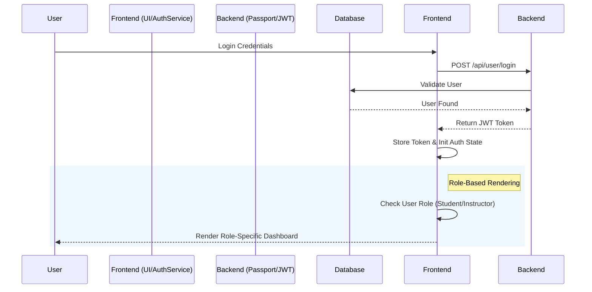

[English](README.md) | [繁體中文](README.zh-TW.md)

# Course Management System - Full-stack Engineering Practice

A curriculum management system built on the MERN Stack (MongoDB, Express, React, Node.js). This project focuses on implementing Permission-driven Architecture and a consistent full-stack validation mechanism to ensure data integrity and UI predictability.

- **Live Demo**: [course.tinahu.dev](https://course.tinahu.dev/)
- **Test Accounts**:
  - Student: `demo.student@tinahu.dev` / `DemoCourse2026`
  - Teacher: Invitation code required for registration. Available upon request for interview demos.

---

## Project Motivation

This project addresses common full-stack challenges:

- **Permission-driven UI**: Managing distinct workflows and views for different roles (Teachers vs. Students).
- **Validation Consistency**: Reducing maintenance costs caused by inconsistent validation rules across the stack.
- **Unified Error Handling**: Establishing a standardized API response and error interception mechanism.

---

## Engineering Challenges & Decisions

### 1. Permission-driven UI Architecture

- **Challenge**: Scattering authorization logic across UI components leads to high maintenance costs, code duplication, and potential security loopholes.
- **Solution**: Implemented a centralized **Auth & Role State Management** system. UI components are completely decoupled from permission logic, rendering content strictly based on the state provided by the permission service.
- **Result**: Achieved **flicker-free** role-based navigation and improved architectural scalability, allowing for easy integration of new roles (e.g., Teaching Assistants) without modifying component logic.



### 2. Mirrored Validation Strategy

- **Challenge**: Inconsistent validation rules between frontend and backend (e.g., length limits) lead to poor UX and fragile systems.
- **Solution**: Established **Mirrored Validation Logic** using **Joi Schemas**. Although environments are physically separated, the schemas are strictly mirrored to ensure that data integrity is maintained from the initial client input interception to the final database write.
- **Result**: Significantly reduced debugging overhead from API errors (400 Bad Request) and ensured strict data consistency across the entire platform.

### 3. Secure Authentication with JWT & Passport.js

- **Strategy**: Adopted a stateless authentication architecture using **JWT** combined with **Passport.js** strategies.
- **Implementation**: Developed custom middleware to enforce **Role-Based Access Control (RBAC)** on protected routes, ensuring critical features (e.g., Course Creation) remain inaccessible to unauthorized users.

### 4. Global Error Handling & Resilience

- **Challenge**: Ad-hoc error handling scattered across controllers and components results in technical debt, difficult debugging, and disjointed user experiences.
- **Solution**:
  - **Backend**: Engineered a **Centralized Error Handling Middleware** to intercept unhandled exceptions and enforce a standardized API error response structure.
  - **Frontend**: Integrated **Error Boundaries** and **Axios Interceptors** to catch render failures or specific HTTP status codes (e.g., 401/403), triggering automated fallback UIs or redirection flows.
- **Result**: Enhanced system **Fault Tolerance**, ensuring the application degrades gracefully instead of crashing into a "White Screen of Death" during partial failures.

---

## Data Model Design

This project utilizes a **Reference (Normalization)** strategy to handle Many-to-Many (M:N) relationships, balancing data consistency with query performance.

- **User Model**: Contains a `courses` array storing `Course ObjectIds` for enrollment/teaching.
- **Course Model**: Contains `instructor` (single reference) and `students` (array reference).
- **Design Decision**: Implemented **Two-way Referencing**. While this requires maintaining consistency on writes, it significantly optimizes read performance for key queries (e.g., "Find all courses for a student" or "Find all students for a course"), which aligns with the read-heavy nature of an LMS.

---

## Key Features

- **Role-based Dashboard**: Distinct interfaces and functionalities tailored for Teachers and Students.
- **Course Lifecycle Management**: Full implementation of creating, editing, publishing, and enrolling in courses.
- **RESTful API Design**: Semantic API endpoints handling relationships between User and Course entities.
- **Axios Interceptors**: Encapsulated Axios instances for automatic token injection and standardized error handling.

---

## Tech Stack

- **Frontend**: React, React Router, Modular CSS Architecture (Component-based styles)
- **Backend**: Node.js, Express
- **Database**: MongoDB (Mongoose ODM)
- **Auth**: JWT, Passport.js
- **Validation**: Joi
- **Deployment**: Render / Vercel

---

## Project Structure & Design Principles

This project follows a decoupled frontend-backend architecture with a modular design:

```text
client/               # React frontend application
  src/components/     # UI components (Common and Page-specific)
  src/services/       # Encapsulated API logic (Auth, Course, Permission)
  src/validation/     # Frontend Joi schemas
models/               # Mongoose data models (User, Course)
routes/               # Express routes with permission middleware
validation/           # Backend Joi logic (Synced with frontend)
server.js             # Server entry point and middleware configuration
```

- **Separation of Concerns**: Clear division between business logic (Service), data models (Model), and route control (Controller/Route).
- **Mirrored Validation Logic**: Validation schemas are strictly mirrored between frontend and backend to ensure consistency.
- **Decoupling UI & Logic**: Frontend components do not contain complex permission logic; instead, a dedicated Auth Service manages the state unifiedly.

---

## Quality Assurance

- **CI/CD Automation**:
  Integrated Render (Backend) and Vercel (Frontend) to implement CI/CD pipelines, ensuring every code push undergoes build verification for automated delivery.

- **Security Checks**:
  Implemented stateless JWT validation and backend middleware to enforce strict route protection and role-based access control, preventing unauthorized access.

- **Code Standards**:
  Enforced strict code styles to ensure semantic naming and structural consistency, improving project maintainability.

---

### Getting Started

#### 1. Clone Project

```bash
git clone https://github.com/yuting813/course-management-system.git
cd course-management-system
```

#### 2. Install Dependencies

```bash
# Install server dependencies
npm install

# Install client dependencies
npm run clientinstall
```

#### 3. Environment Variables

```bash
# Create .env file in root and client folder based on examples
cp .env.example .env
```

#### 4. Run Development Server

```bash
npm run dev
```

---

## About Me

This project showcases my ability to design production-ready full-stack architectures with a focus on rigorous permission models and data validation.

- **Email**: tinahuu321@gmail.com
- **LinkedIn**: [Tina Hu](https://www.linkedin.com/in/tina-hu-frontend)
