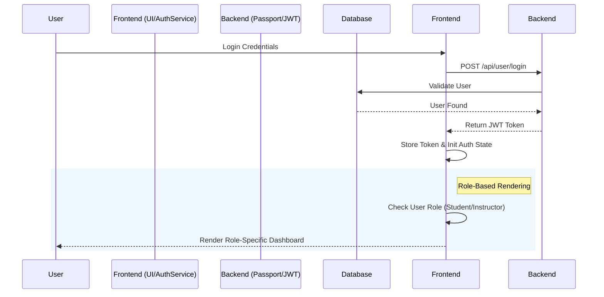

[English](README.md) | [繁體中文](README.zh-TW.md)

# Course Management System - 全端課程管理系統實踐

這是一個基於 MERN Stack (MongoDB, Express, React, Node.js) 開發的課程管理平台。本專案的核心在於實踐權限驅動的架構設計 (Permission-driven Architecture) 與前後端鏡像驗證機制，確保複雜全端應用中的資料完整性與 UI 行為的一致性。

- **Live Demo**: [course.tinahu.dev](https://course.tinahu.dev/)
- **測試帳號**：
  - 學生身分：`demo.student@tinahu.dev` / `DemoCourse2026`
  - 教師身分：講師註冊需要邀請碼，面試時可提供以便現場測試。

---

## 為什麼做這個專案

本專案旨在解決全端開發中常見的權限管理與資料同步難題：

- **權限驅動 UI**：確保不同角色（教師與學生）在同一系統下具備完全不同的操作流程與視圖。
- **資料驗證鏡像化**：解決前後端驗證規則不一導致的維護成本。
- **全端錯誤處理**：建立一套標準化的 API 回應與錯誤攔截機制。

---

## 核心技術挑戰與決策 (Engineering Challenges & Decisions)

### 1. 權限驅動的 UI 系統設計 (Permission-driven UI Architecture)

- **挑戰**：在複雜應用中，若權限判斷邏輯分散在元件內，會造成維護困難且容易產生權限漏洞。
- **對策**：實作集中化的 Auth 與 Role 狀態管理。UI 元件本身不持有權限邏輯，而是根據權限服務回傳的狀態來決定渲染行為。
- **成果**：實現了「初始化無閃爍」的角色導航，且當新增角色（如助教）時，僅需調整 Service 層，無需大規模修改元件。



### 2. 前後端邏輯鏡像化 (Mirrored Validation Strategy)

- **挑戰**：傳統開發常因前後端驗證規則不一致（如：前端限制 10 字，後端限制 20 字），導致 UX 不一致與維護困難。
- **對策**：建立 **Mirrored Validation Logic**。雖然前後端因環境限制實體檔案分離，但我實作了嚴格對應的 Joi Schemas。確保資料從進入前端表單攔截，到後端寫入資料庫前，都遵循完全一致的格式規範。
- **成果**：大幅降低了因格式不符產生的 API 錯誤（400 Bad Request），提升了系統的資料強健性 (Data Integrity)。

### 3. JWT 與 Passport.js 的安全性實踐

- **對策**：採用 JWT 進行無狀態驗證，並結合 Passport.js 策略模式管理身份認證。透過自定義中間件保護受限路由，確保教師功能（如開設課程）不會被非授權角色存取。

### 4. 系統韌性與錯誤邊界 (Resilience & Global Error Boundary)

- **對策**：
  - **後端**：實作 **Centralized Error Handling Middleware**，將所有 Operational Errors 統一標準化回傳。
  - **前端**：結合 **Axios Interceptor** 與 **React Error Boundary**，主動攔截 401/403 等驗證錯誤並自動引導流程，防止單一元件崩潰導致整個應用程式白屏 (White Screen of Death)。

---

## 資料模型設計 (Data Model Design)

本專案採用 **Reference (Normalization)** 策略來處理多對多 (M:N) 關係，平衡資料一致性與查詢效能。

- **User Model**: 包含 `courses` 陣列，儲存該用戶參選/開課的 `Course ObjectId`。
- **Course Model**: 包含 `instructor` (單一參照) 與 `students` (陣列參照)。
- **設計考量**: 透過雙向參照 (Two-way Referencing)，雖然寫入時需維護兩端的一致性，但大幅提升了「查詢某學生所有課程」與「查詢某課程所有學生」的讀取效能，適合讀多寫少的 LMS 場景。

---

## 主要功能

- **角色切換系統**：具備教師與學生雙重身分，具備各自專屬的 Dashboard。
- **課程生命週期管理**：實作課程的建立、編輯、發佈與學生端選課功能。
- **RESTful API 設計**：設計語義化的 API 端點，處理跨實體（使用者與課程）的關聯操作。
- **前端攔截器**：封裝 Axios 實例與攔截器，自動處理 Token 夾帶與錯誤狀態分流。

---

## 技術棧

- **Frontend**: React, React Router, Modular CSS Architecture (Component-based styles)
- **Backend**: Node.js, Express
- **Database**: MongoDB (Mongoose ODM)
- **Auth**: JWT, Passport.js
- **Validation**: Joi
- **Deployment**: Render / Vercel

---

## 專案結構與設計原則

本專案採用前後端分離架構，並遵循模組化設計原則：

```text
client/               # React 前端應用
  src/components/     # UI 元件 (分為共用元件與頁面專屬元件)
  src/services/       # 封裝 API 呼叫邏輯 (Auth, Course, Permission)
  src/validation/     # 前端 Joi 驗證 Schema (鏡像後端邏輯)
models/               # Mongoose 資料模型定義 (User, Course)
routes/               # Express 路由控制，結合權限中間件
validation/           # 後端 Joi 驗證邏輯
server.js             # 伺服器入口點與中間件配置
```

---

## 品質保證 (Quality Assurance)

- **CI/CD 自動化部署**：
  串接 Render (後端) 與 Vercel (前端) 實作 CI/CD 流程，確保每次代碼推送皆經過構建檢驗，實現自動化交付。

- **安全性控管**：
  實作 JWT 無狀態驗證機制，並透過後端中間件 (Middleware) 進行嚴格的路由保護與角色權限篩選，防止越權存取。

- **代碼規範**：
  遵循嚴格的程式碼風格，確保命名語義化與結構一致性，提升專案可維護性。

---

### Getting Started

#### 1. 複製專案

```bash
git clone https://github.com/yuting813/course-management-system.git
cd course-management-system
```

#### 2. 安裝依賴

```bash
# 安裝後端依賴
npm install

# 安裝前端依賴
npm run clientinstall
```

#### 3. 設定環境變數 (請參考 .env.example)

```bash
# 請在根目錄與 client 目錄下分別建立 .env 檔案
cp .env.example .env
```

#### 4. 啟動開發伺服器

```bash
npm run dev
```

---

## 關於我 (About Me)

擁有 6 年採購管理經驗，習慣在**高風險與嚴格合規**的環境下工作。我將這種對**流程控制 (Process Control)** 與 **風險管理 (Risk Management)** 的堅持帶入軟體開發：

- **採購合規 → 系統權限設計 (RBAC)**：確保只有對的人能做對的事。
- **供應商規格檢驗 → 全端資料驗證 (Mirrored Validation)**：確保進入系統的每一筆資料都是乾淨可信的。

這不只是一個課程平台，更是我對**系統穩定性與可預測性**的實踐。

- **Email**: tinahuu321@gmail.com
- **LinkedIn**: [Tina Hu](https://www.linkedin.com/in/tina-hu-frontend)
